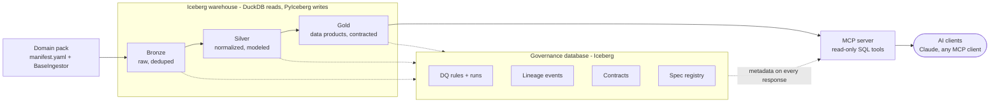

<h1 align="center">Brightsmith</h1>

<p align="center"><i>A data pipeline framework where AI agents do the data engineering — point it at any raw data source and get governed, documented, AI-queryable datasets without telling it what the data means.</i></p>

<p align="center">
  <a href="https://github.com/hyena-studios/brightsmith/actions/workflows/ci.yml"></a>
  
  
  
  
</p>

```
Raw JSON/CSV/API  →  ⛏️ Bronze  →  ⚒️ Silver  →  🥇 Gold  →  🤖 MCP server
                      ingest       normalize     data        AI agents query
                      as-is        + model       products    governed data
                          └────────── governance at every step ──────────┘
```

---

## The problem

You have a raw data source — an API, a directory of files, a database — and you want AI agents to answer questions about it reliably. Between those two points sits the work nobody budgets for: profiling the data, normalizing identifiers, writing quality rules, documenting business terms, tracking lineage, and versioning contracts so that when an agent quotes a number, the number is right and you can prove where it came from.

Most pipeline frameworks assume you do that work by hand and know the domain upfront. Brightsmith inverts both assumptions: **25 specialized AI agents do the data engineering**, and the framework **discovers the domain from the data itself** — profiling it, interviewing you about what it found, and writing a canonical domain-context document every downstream agent reads. The output is a set of Apache Iceberg tables with executable quality rules, machine-readable contracts, column-level lineage, and an MCP server that serves the data to any AI client with governance metadata attached to every response.

Brightsmith was extracted from a production SEC EDGAR financial pipeline and field-tested by [FutureProof](https://github.com/jcernauske/futureproof-data), an education/career-outcomes product built on 8 federal data sources. Same rigor, any data.

## Status

**Alpha (0.4.x), actively developed.** The core pipeline, governance database, and MCP zone are functional and tested (825 tests, CI-gated lint/type/coverage, plus a wheel-install smoke test that scaffolds and runs a project from scratch on every push). Interfaces may still change between minor versions — see [Roadmap and known limitations](#roadmap-and-known-limitations).

Maintainer: [Jeff Cernauske](https://github.com/jcernauske) · Issues: [GitHub issue tracker](https://github.com/hyena-studios/brightsmith/issues)

## Features

- **Discovers the domain from the data.** An analyst agent profiles your raw tables, a domain-context agent interviews you about what it found, and the resulting `domain-context.md` becomes the single source of domain truth for all downstream agents — no drift, no independent assumptions.
- **Runs two ways with the same core.** As a Claude Code plugin (agents orchestrate every step through approval gates) or fully headless (`python -m brightsmith.run` — pure Python, no LLM calls, cron/Airflow-ready).
- **Executes data quality rules against real data.** SQL rules with P0/P1/P2 priorities run against live Iceberg tables via DuckDB; P0 failures block the pipeline. Rules follow a PROPOSED → APPROVED → ACTIVE lifecycle with a human-approval toggle.
- **Hardens rules adversarially.** A chaos-monkey module injects type-appropriate corruptions into shadow tables across escalating cycles until the rule set catches everything it should.
- **Writes idempotently.** Every derived row gets a deterministic SHA-256 grain ID; re-running a pipeline with the same data produces zero new rows, at every zone.
- **Serves data to AI agents with governance attached.** The MCP zone exposes governed tables through read-only, injection-hardened SQL tools; every response carries contract version, DQ status, and lineage so the client can calibrate confidence.
- **Fails loudly, by policy and by test.** A moved warehouse raises an error naming the exact repair command instead of returning empty results; a meta-test fails CI on any silently swallowed exception in the codebase.
- **Tracks everything in an Iceberg-backed governance database.** Spec registry, DQ runs, agent activity, contracts, lineage events, CAB decisions — queryable like any other table.
- **Exports an [Open Semantic Interchange](https://github.com/open-semantic-interchange/OSI) semantic model.** `python -m brightsmith.infra.osi generate` composes contracts, glossary, data models, and domain context into one OSI v1.0 YAML — datasets, relationships, metrics, and AI context consumable by any OSI-aware platform — and `... osi check` fails loudly when it drifts from the governance artifacts. The MCP server serves it as `brightsmith://semantic-model`.

## Architecture



Two runtimes drive the same zone code: the **Claude Code plugin** (25 agents, spec-driven, human approval gates, enforced step-by-step by a pipeline state machine) and the **headless runner** (no agents, no LLM calls — transforms, DQ gates, contract verification, and golden-dataset checks as plain Python with meaningful exit codes).

## Tech stack

| Layer | Technology |
|---|---|
| Table format | Apache Iceberg (PyIceberg ≥ 0.7, local SQLite catalog — no server) |
| Query engine | DuckDB ≥ 1.0 with the Iceberg extension |
| Language | Python 3.11+ |
| AI serving | MCP (Model Context Protocol) SDK, stdio transport |
| Agent runtime | Claude Code plugin (25 agents, 9 skills, 2 hooks) — optional |
| Packaging | uv + hatchling |

## Quickstart

### Option 1 — Claude Code plugin (agent-driven)

```bash
/plugin install    # point at https://github.com/hyena-studios/brightsmith

/bs:init My domain description          # scaffold a domain project
/bs:mine raw-ingest-my-source           # Bronze: ingest
/bs:smelt base-my-entities              # Silver: normalize + model
/bs:cast consumable-my-metrics          # Gold: data products
/bs:serve                               # start the MCP server
/bs:status                              # project dashboard, anytime
```

Each zone command runs the full agent pipeline for that zone — profiling, DQ rule writing and execution, chaos-monkey hardening, lineage capture, documentation, and a final staff-engineer review — and prints a summary with real row counts and artifact links.

### Option 2 — Headless (no agents)

#### Prerequisites

- Python ≥ 3.11
- ~1 GB free disk for a small project's warehouse (grows with your data)

#### 1. Install and scaffold

```bash
pip install git+https://github.com/hyena-studios/brightsmith.git
python -m brightsmith.setup init --name my-project
cd my-project
```

#### 2. Describe your data source

Edit `domain/manifest.yaml` and `domain/sources/<source>.yaml`, and write an ingestor that extends `BaseIngestor` with two methods — `fetch()` (get the raw data) and `flatten()` (turn it into rows). Working examples live in [`tests/fixtures/consumer/`](tests/fixtures/consumer/) and [`domain/manifest.yaml.example`](domain/manifest.yaml.example).

#### 3. Run

```bash
python -m brightsmith.run --zone bronze     # ingest into the Iceberg warehouse
python -m brightsmith.run                   # all registered zones, in order
python -m brightsmith.run --validate-only   # DQ + contracts, no writes
python -m brightsmith.run --headless-ready  # readiness diagnostic
```

Exit codes distinguish DQ failures (1), transform errors (2), contract violations (3), and config errors (4) — scheduler-friendly.

This exact journey — wheel install, scaffold, ingest, MCP query — runs on every push as [`scripts/consumer_journey_smoke.sh`](scripts/consumer_journey_smoke.sh), so the Quickstart is CI-verified, not aspirational.

## Configuration

All settings resolve at call time with this priority: `configure()` arguments → `BRIGHTSMITH_*` environment variables → defaults.

| Variable | Required | Default | Description |
|---|---|---|---|
| `BRIGHTSMITH_PROJECT_ROOT` | no | current directory | Root of the domain project (warehouse, governance, and config paths derive from it) |
| `BRIGHTSMITH_PROJECT_NAME` | no | `brightsmith` | Catalog name; used in lineage and governance records |
| `BRIGHTSMITH_REQUIRE_HUMAN_APPROVAL` | no | `true` | Master toggle for all human-in-the-loop gates (see below) |
| `BRIGHTSMITH_CONFIDENCE_FLOOR` | no | `0.7` | Entity-resolution proposals below this confidence require review |

## Human-in-the-loop

`REQUIRE_HUMAN_APPROVAL` is the single global switch. When `true`: business terms, data-model stages, low-confidence entity resolutions, and DQ rules all pause for review, with plain-English approval documents generated at each gate. When `false` (dev/demo mode): everything auto-approves, but the audit trail still records what was auto-approved and every artifact is still produced. Exception: MAJOR schema changes always require human approval through the change-advisory-board agent, regardless of the toggle.

## The agent pipeline

Every zone runs a 12-step agent pipeline — governance review, ingestion/transform, EDA, domain-context synthesis, DQ rule writing, DQ execution, chaos-monkey hardening, lineage capture, CDE tagging, documentation, a post-implementation completeness check, and a final staff-engineer quality gate. A state machine ([`pipeline_gate.py`](src/brightsmith/infra/pipeline_gate.py)) enforces the order: an agent can't run until its prerequisites completed, and a spec can't be marked complete until every step ran or was explicitly skipped with a documented justification.

Zone boundaries add a blocking architecture review, and silver→gold / gold→mcp transitions add a strategic analysis recommending what data products to build next.

The full roster and workflow documents:

- [Bronze pipeline](docs/workflows/bronze-pipeline.md) — including domain discovery
- [Silver & Gold pipeline](docs/workflows/silver-gold-pipeline.md)
- [Zone transitions](docs/workflows/zone-transitions.md) · [MCP pipeline](docs/workflows/mcp-pipeline.md) · [Approval gates](docs/workflows/human-approval-gates.md)
- Agent definitions: [`agents/`](agents/) (25 markdown personas)
- Full catalog of governance artifacts and paths: [`CLAUDE.md`](CLAUDE.md) (the pipeline's working rules)

## Data quality

- **Rules are SQL against real tables**, never placeholders — executed with `python -m brightsmith.infra.dq_runner run`, results stored in the governance database, scorecards generated from actual runs.
- **Lifecycle:** rules start PROPOSED, execute only once APPROVED or ACTIVE. With approval required, unapproved rules are skipped with a loud warning naming the approve command; with approval off, they auto-advance at execution time.
- **Chaos monkey** (`python -m brightsmith.infra.chaos_monkey`) corrupts shadow copies of your tables — type-aware row, distribution, and semantic corruptions — then reruns your rules to find what they miss. The gap report drives rule patches; the loop repeats until two consecutive clean cycles.
- **Golden datasets** pin known-correct reference values per data product; verification runs in the headless pipeline and blocks completion on mismatch.
- **Contracts** (`python -m brightsmith.infra.contract`) capture schema, grain, freshness, and quality guarantees per table as YAML, with verify/diff/deprecate lifecycle commands and semver-gated schema changes.

## Governance database maintenance

Every governance event is one Iceberg append — one snapshot plus a small parquet file — and reads scan the full table. This is fine for months of normal use; a long-lived, chatty project (thousands of events) should periodically expire old snapshots:

```python
from datetime import UTC, datetime, timedelta

from brightsmith.config import CATALOG_PATH, GOVERNANCE_WAREHOUSE
from brightsmith.infra.iceberg_setup import get_catalog

catalog = get_catalog(GOVERNANCE_WAREHOUSE, CATALOG_PATH)
table = catalog.load_table("governance_product.dq_rule_results")  # repeat per table

cutoff = datetime.now(UTC) - timedelta(days=90)
table.maintenance.expire_snapshots().older_than(cutoff).commit()
```

This drops old snapshot metadata safely, without downtime; it does not compact small parquet files (PyIceberg doesn't expose compaction at the pinned version — at this framework's target scale, that's acceptable). `governance/run-history/` JSON files also accumulate one-per-run (gitignored); prune by age when disk matters.

## Moving or cloning a project

Iceberg bakes **absolute** paths into four metadata layers. If you move, clone, or containerize a project with a populated warehouse, reads would silently return empty — so Brightsmith refuses instead: any read against a relocated warehouse raises `WarehouseRelocationError` naming the repair command.

```bash
python -m brightsmith.infra.relocate --check      # read-only: list stale baked paths
python -m brightsmith.infra.relocate --apply      # rewrite all four layers to this root (idempotent, atomic)
python -m brightsmith.infra.relocate --relative   # repo-relative paths, for committing a warehouse to git
```

## What you provide (domain pack)

| What | Where | Purpose |
|---|---|---|
| Manifest | `domain/manifest.yaml` | Sources, pipeline steps per zone, optional MCP server class |
| Source config | `domain/sources/*.yaml` | Entity IDs, fetch methods, dedup grain — single- or multi-table |
| Ingestor | `src/raw/my_ingestor.py` | `fetch()` + `flatten()`, extending `brightsmith.bronze.BaseIngestor` |
| Concept mappings | `domain/concept-mappings/*.json` | Optional — discovery mode kicks in if absent |
| Glossaries | `glossaries/` | Optional standard/domain term definitions |

Everything entity-specific lives here or in governance artifacts — never in Python. Adding a new entity is a config change and a re-run, not a code change; the framework treats hardcoded entity data as a governance violation.

## Project structure

```
brightsmith/
├── src/brightsmith/          Framework package (pip-installable)
│   ├── bronze/               BaseIngestor — ingest, dedup, metadata
│   ├── silver/               Concept normalization (tiered matching)
│   ├── mcp/                  BaseMCPServer — read-only SQL tools, response enrichment
│   ├── infra/                Pipeline gate, DQ runner, contracts, lineage,
│   │                         promote/grain, chaos monkey, relocate, governance DB
│   ├── run.py                Headless pipeline runner
│   └── setup.py              Project scaffolding CLI
├── agents/                   25 agent personas (Claude Code plugin)
├── skills/                   9 slash commands (/bs:init … /bs:status)
├── hooks/                    Plugin hooks (session setup, agent-type enforcement)
├── scripts/                  consumer_journey_smoke.sh (CI wheel-install test)
├── docs/workflows/           Zone pipeline playbooks
├── docs/specs/               Spec-driven development record
├── governance/               Shipped templates + your project's artifacts
└── tests/                    825 tests, by zone + integration + fixtures
```

## Testing

```bash
uv run python -m pytest tests/ -q        # full suite (~2 min)
uv run ruff check src tests              # lint
uv run pyright                           # type check
bash scripts/consumer_journey_smoke.sh   # wheel-install end-to-end smoke (~3 min)
```

CI runs all four on Python 3.11 and 3.12, plus a warehouse-relocation guard. Two meta-tests enforce codebase policy: no silently swallowed exceptions anywhere in `src/`, and no leaked database connections across the suite.

## Roadmap and known limitations

- **Governance database compaction is manual.** Snapshot expiration is documented (above) but not scheduled automatically; automation is planned.
- **MCP row-level security is deferred.** The SQL surface is read-only and injection-hardened, but per-user entitlements wait until non-localhost deployment is a real use case.
- **The agent pipeline requires Claude Code.** Headless mode covers execution and validation, but domain *discovery* (EDA interview, context synthesis) is agent-only today.
- **Breaking change in unreleased 0.5:** DQ rules without a `status` field now default to `proposed` instead of executing immediately. Migration: add `"status": "active"` to existing rule files or run `python -m brightsmith.infra.dq_runner approve <rule-ids>`.
- **Multi-table sources are dedup-grain-uniform.** A `tables:` source shares one dedup grain across its tables; per-table grains are planned.

## Contributing

Framework improvements (a fix in `dq_runner.py`, a new `BaseIngestor` capability) belong in this repo. Domain-specific artifacts — ingestors, governance content, specs — stay in your domain project. Development follows a spec-driven workflow: see [`docs/specs/`](docs/specs/) for the format and [`CLAUDE.md`](CLAUDE.md) for the working rules. Run the four test commands above before opening a PR.

## License

Released under the [Apache License 2.0](LICENSE).

## Acknowledgments

Built on [Apache Iceberg](https://iceberg.apache.org/) via [PyIceberg](https://py.iceberg.apache.org/), [DuckDB](https://duckdb.org/), and the [Model Context Protocol](https://modelcontextprotocol.io/). Agent orchestration runs on [Claude Code](https://claude.com/claude-code).
